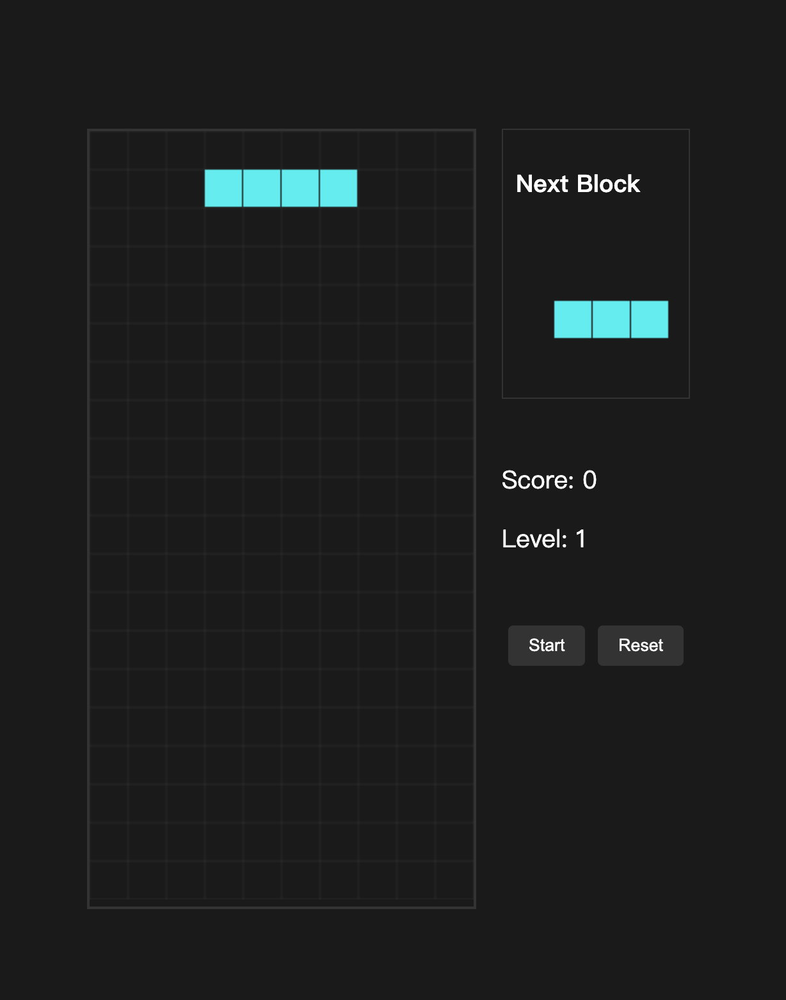

# Tetris Game

一个使用 Vue 3 + TypeScript + Vite + Electron 开发的俄罗斯方块游戏。

## 技术栈

- Vue 3
- TypeScript
- Vite
- Electron
- Node.js

## 开发环境要求

- Node.js (推荐 v16 或更高版本)
- npm (推荐 v8 或更高版本)

## 项目设置

### 安装依赖
